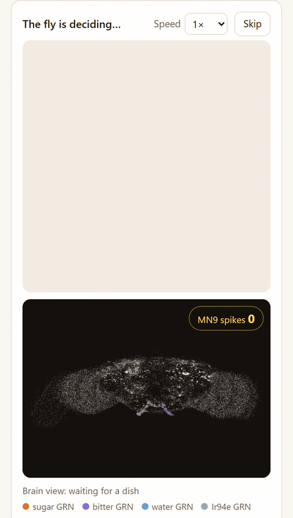

# Ask the Fly
Ask the Fly lets a fruit-fly brain model taste a few dishes and pick one for you.

中文说明：[README.zh.md](README.zh.md)

Try it: https://askthefly.app/

**What's new** (full list in [CHANGELOG.md](CHANGELOG.md))
- v1.1.1 (2026-09-12): the brain view follows the fly to the dish it picks; the empty "Brain response:" line is gone.
- v1.1.0 (2026-09-12): the fly can tell savory dishes apart, with a new amino-acid dimension; meat- and soy-seasoned dishes now score very low (the model's property); a "didn't care much for any of these" line when nothing scores above 5 Hz.
- v1.0.0 (2026-09-11): launch.



## Layout
- `scripts/` — extraction and analysis utilities
- `sim/` — simulation code (added in a later phase)
- `data/` — frozen inputs, protocols, and generated results
- `docs/` — project documentation
- `site/` — static front end (no build step, no LLM calls); see docs/site.md
- `vendor/` — gitignored, read-only upstream reference data and code

## Attribution and data provenance
- FlyWire v783 connectome data: CC BY-NC 4.0.
- Shiu et al. (2024), *Nature*, model code: MIT.
- Eon fly-brain benchmark repository: GPL-2.0; used as read-only reference/data, with no code copied.
- Assets: the 41 dish sprites and the fly sprite sheet (`site/assets/`) are original pixel art generated for this project, released under CC BY 4.0; the code stays MIT. Only the processed sprites are tracked; the raw 1024 px sources in `assets/raw/` are not.
- FlyWire neuron annotations (Schlegel et al. 2024; github.com/flyconnectome/flywire_annotations): CC BY 4.0.
- Share-card QR codes: qrcode-generator 2.0.4 (Kazuhiko Arase), MIT, vendored unmodified in `site/vendor/qrcode-generator/` with its license.
- Display fonts (self-hosted, woff2, subset by `scripts/prep_fonts.py`): Pixelify Sans (Stefie Justprince and the Pixelify Sans Project Authors), SIL Open Font License 1.1, `site/assets/fonts/LICENSE-PixelifySans.txt`; Fusion Pixel 12px proportional (TakWolf; built on Ark Pixel, Cubic 11 and Galmuri), SIL Open Font License 1.1, `site/assets/fonts/LICENSE-FusionPixel.txt`. The CJK font is subset to the characters the site shows (`site/assets/fonts/glyphs-zh.txt`); anything else falls back to the system CJK sans.
- Neuropil outlines in the brain view: JFRC2NP neuropil surfaces (Ito et al. 2014 nomenclature) transformed into FlyWire space, taken from the data folder of fafbseg-py (github.com/navis-org/fafbseg-py, GPL-3.0; used as data only, no code copied), projected to 2D by `scripts/export_neuropils.py`. The mesh archive lives in `data/external/` and is not tracked.
- Named SEZ neurons (`data/named_neurons.json`): IDs from the Shiu et al. 2024 SEZ neuron dictionary shipped with the paper's figure code (MIT) and, for DNg103, from the FlyWire annotations; Quasimodo, Scapula, GNG016 and GNG510 have no FlyWire v783 match in either source and are recorded as such. Used for the soma positions behind the brain view (`site/data/neurons.json`); the table itself lives in `data/external/` and is not tracked.

## Citations
Simulation basis (what the scores come from):
- Shiu, P.K., et al. (2024). A Drosophila computational brain model reveals sensorimotor processing. *Nature*. PMC11446845. Model code (MIT): github.com/philshiu/Drosophila_brain_model.
- FlyWire v783 connectome (Dorkenwald et al. 2024; Schlegel et al. 2024), CC BY-NC 4.0.
- Schlegel, P., Yin, Y., Bates, A.S., et al. (2024). Whole-brain annotation and multi-connectome cell typing of Drosophila. *Nature* 634, 139–152. Annotation table (nucleus positions, cell types): CC BY 4.0.

Related work, not part of this simulation (see docs/open_questions.md, OQ-2):
- Berg, S., Beckett, I.R., Costa, M., … Hess, H.F., Rubin, G.M., Jefferis, G.S.X.E. (2026). Sexual dimorphism in the complete Drosophila male central nervous system connectome. *Cell* 189(18), 5504–5526.e15. https://doi.org/10.1016/j.cell.2026.08.015 (MaleCNS; male brain + VNC).
- Tastekin, I., de Haan Vicente, I., Beresford, R.J., Morris, B.J., Beckett, I., Schlegel, P., Gkantia, M., Marin, E.C., Costa, M., Jefferis, G.S.X.E., Ribeiro, C. (2026). The complete gustatory connectome of adult Drosophila reveals how taste guides feeding, foraging, and social behavior. *Cell* 189(18), 5527–5551.e5. https://doi.org/10.1016/j.cell.2026.08.016.

Product copy for provenance: "Scores come from a published female-brain LIF model (Shiu 2024 / FlyWire v783). The September 2026 papers describe a more complete taste wiring diagram that is not part of this simulation."

## What you see on screen

- **A recorded brain replay.** The dark panel shows 29,326 neurons at their FlyWire soma positions and replays one recorded second of activity for the current taste condition. The flashes are recorded spike times from the Brian2 model, not a live browser simulation.
- **A fly animation driven by the model's result.** The fly visits each plate, then goes to the option with the strongest mean MN9 response. "Do the opposite" picks the weakest instead. Exact ties stay tied.
- **Taste estimates from an LLM, brain responses from the connectome model.** Each dish is assigned sugar, bitter, and water levels by the encoder (`data/dishes.json`). Those levels point to one cell in a precomputed 400-cell lookup table.
- **Everything is reproducible.** The replay files store the condition, firing levels, seed, commit, and protocol hash. `scripts/run_replay.py` generates them.

## What the model does — and what it doesn't
| Claim | Status | Source |
|---|---|---|
| Scores come from a published female-brain LIF model on FlyWire v783 | yes | Shiu et al. 2024; docs/phase0_report.md |
| Sugar drives, bitter suppresses, MN9 as the proboscis-extension readout | reproduced (directions) | docs/phase0_report.md, gates A–D |
| The model has spontaneous activity | **no** — baseline is 0 Hz by construction | Shiu 2024 Methods; our condition D |
| Disinhibition (the enriched LB3 → Quasimodo → MN motif) is expressed | **no** — zero basal firing means there is no tonic inhibition to release; v1 captures the feedforward Clavicle path only | Tastekin et al. 2026, Fig 6I/6J, Fig S17; docs/open_questions.md OQ-3 |
| Covers the whole feeding sequence | **no** — real feeding is a chain of checkpoints: leg bristles → labellar bristles → taste pegs → pharynx. This simulation covers the labellar-bristle checkpoint only. | Tastekin et al. 2026, Discussion, "Sequential checkpoints and action control" |
| Water is a separate taste quality in the model | **no** — in this model water acts as a second appetitive drive that mainly boosts weak sugar (sugar 40 Hz + water 40 Hz gives 24 Hz MN9 vs 4 Hz alone; at sugar 200 Hz it adds 7%). That is why a wet savory dish outranks a dry one. This is a property of the connectome model, not a rule we wrote. | docs/phase1_characterization.md, sugar × water |
| Ir94e is the amino-acid-aversion channel (Tastekin et al. 2026, LB1e). The assignment of each dish to an Ir94e level is ours (encoder v2.3). Its effect on MN9 is the model's: at sugar low / water low, MN9 goes 61.8 → 9.3 → 1.6 → 0.5 Hz across none / low / medium / high. In this model a fly ranks plain starches above every meat or soy-seasoned dish. The strength of this suppression is uncalibrated against behaviour (docs/open_questions.md OQ-6). | direction reproduced, mapping designed | docs/phase1_characterization.md, sugar × ir94e; docs/encoder_stability_v2_3_batch2.md |
| Uses the September 2026 complete gustatory wiring (MaleCNS) | **no** — a different animal, not part of this simulation | docs/open_questions.md, v3 note |
| Tonic inhibition / disinhibition (Tastekin 2026, Fig S17) | not in the product; a designed condition (docs/tonic_inhibition.md). CB0806 or CB0862 driven at 100 Hz hold MN9 down against sugar; none of the three brakes is silenced by sugar, so disinhibition was not observed under this design. Sugar does recruit CB0465, a feed-forward brake already inside every product score. Brake choice and drive level are ours, uncalibrated. | docs/tonic_inhibition.md; OQ-3 |
| The brain view shows a live simulation | **no** — it replays one recorded 1 s trial per grid cell (fixed seed) from the same model; positions are FlyWire soma coordinates, activity is the recorded spike times | docs/site.md, `site/data/replay/` headers |
| The fly animation is measured behaviour | **no** — it is a scripted animation driven by the lookup table's MN9 means and the recorded replays; the model has no body, legs or proboscis, only MN9 firing | docs/site.md |
| The fly's ranking is a live computation | **no** — a 400-cell lookup table precomputed from 30 trials per cell (`data/lookup_table.json`); the page only reads it | docs/grid_provenance.md |

In this model weak water is only visible as a helper to sugar; the fly notices water when the food is mostly water. The lookup grid therefore gives water "low" and "medium" the same cell (60 Hz): the fixed-path recheck (docs/fixed_path_recheck.md) could not separate them on any curve.

When the fly's own pick scores below 5 Hz MN9 the result adds "this one was just the least uninteresting"; that 5 Hz threshold is ours, it changes the wording only, never the pick or a tie.

Product line: "It only does the first bite."

## Run it, test it, recompute it

Running the built site, running the quick tests, fetching the simulation inputs and recomputing the simulation are four different things. The first two need nothing outside this repository.

**Run the site.** `python -m http.server 8765 --directory site`, then open http://127.0.0.1:8765/. The site is static: every file it reads is in `site/data/` and `site/assets/`; no API key, no vendor data, no build step.

**Run the quick tests.** Node 22: `node --test site/test/app.test.mjs site/test/regress.test.mjs` (pure functions, shipped data, the audit regressions). Python 3.11+, standard library only: `python -m unittest discover -s tests` (encoder merge gate, simulation ledger and seeds, release validator). `python scripts/validate_release.py` checks the production data bundle (no stub, no unreviewed entries, source and site copies in sync, every replay variant present, finite MN9). Browser checks need Playwright: `python scripts/browser_checks.py` against the local server.

**Fetch and verify the inputs.** `vendor/fly-brain/` is not tracked; it is the Eon fly-brain repository at one commit:

```
git clone https://github.com/eonsystemspbc/fly-brain vendor/fly-brain
git -C vendor/fly-brain checkout a3db62f9436074e485c0278290c2164ed6150808
sha256sum vendor/fly-brain/data/2025_Connectivity_783.parquet vendor/fly-brain/data/2025_Completeness_783.csv data/cells.json data/stim_protocol.json data/grid_levels.json
```

Expected SHA-256:

| file | sha256 |
|---|---|
| vendor/fly-brain/data/2025_Connectivity_783.parquet (100.8 MB, v783 connectivity) | `efeb23fb99098e9c390f6869969b2a121a2ee92c833cfc45ecb2c1d8e1af0347` |
| vendor/fly-brain/data/2025_Completeness_783.csv (3.5 MB) | `52b0ac6094cd32c546f8d4c341e094376f48f4e791f8db9b166de5dff8199ea4` |
| data/cells.json (tracked; GRN and MN9 root IDs) | `f78f5071af3bf0984e2e71326f715777c567794e03c0e6369846a147015b395a` |
| data/stim_protocol.json (tracked; rates, trials, readout = left MN9, points at the vendor files) | `9f9495033281bfcd6f3b373551817987deb2cc083ae94ab61fece9065102d82a` |
| data/grid_levels.json (tracked; the 400-cell grid) | `33a1dab4a03a440298d12c7ba2365e88457268b4ee3a220f15981b2702350780` |

The runs record these hashes in their `run_meta.json`; `docs/grid_provenance.md` maps the published tables to the commits that produced them. The scripts stop with a clear message when a vendor file is missing.

**Recompute the simulation.** Gated runs use Brian2 2.9.0 with the Cython target, which needs a C++ compiler; we run them in WSL2 Ubuntu inside the conda env `flybrain` (`env/flybrain.yml`, exact export `env/flybrain-lock.yml`; pitfalls in `docs/environment.md`). Native Windows without `cl.exe` fails at code generation.

```
# from Linux / WSL2, inside the repo, after the inputs above are in place
conda env create -f env/flybrain.yml
conda run -n flybrain --no-capture-output python scripts/run_phase0.py --stage smoke --target numpy   # pipeline check, no compiler needed
conda run -n flybrain --no-capture-output python scripts/run_phase0.py --stage full --n-proc 14       # 540 trials, ~4 min on 14 workers (~3 GB RAM each)
conda run -n flybrain --no-capture-output python scripts/phase0_report.py                              # regenerates docs/phase0_report.md
```

From a Windows shell the same commands run as `wsl -e bash -lc 'cd /mnt/d/<repo> && ~/miniforge3/bin/conda run -n flybrain --no-capture-output python scripts/run_phase0.py --stage full'`.

**What you should see** (left MN9, mean over 30 one-second trials; run-to-run noise is a few Hz because the Poisson stimulus stream differs):

| Gate | Condition | Expected (Hz) |
|---|---|---:|
| A | sugar 25 / 50 / 100 / 200 Hz | ≈ 0 / 17 / 67 / 92 |
| B | sugar 200 Hz + bitter 0 / 25 / 50 / 100 / 200 Hz | ≈ 93 / 79 / 70 / 28 / 1 |
| C | bitter alone, any rate | 0 |
| D | no stimulus | 0 |

The gates are directional (A rises, B falls, C and D stay at zero); absolute values differ from the paper because it calibrated `w_syn` on v630 and we run v783 unchanged. Two full runs on different random streams gave 67.2 and 67.3 Hz at sugar 100 Hz (`docs/phase0_report.md`, `docs/fixed_path_recheck.md`).

**Beyond Phase 0.** `scripts/run_phase1.py` produces the single-channel and pairwise curves in `docs/phase1_characterization.md`; `scripts/run_grid.py --stage full` runs the 400-cell lookup grid (about 80 minutes on 14 workers) and `scripts/build_lookup.py` turns it into `data/lookup_table.json`, the only score file the site reads; `scripts/run_replay.py run` then `pack` record and pack the brain replays in `site/data/replay/`. Trial seeds follow the versioned scheme in `docs/grid_provenance.md` (the published tables were produced under scheme v1; a recompute under v2 gives a different but equivalent random stream).

## How to request a dish

The site only knows dishes in `data/dishes.json`. If it answers "the fly hasn't tried this one yet":

1. Press **Report it** on that line. It opens a prefilled issue at https://github.com/Felix471/ask-the-fly/issues/new with the name you typed. Add the Chinese name, the English name, and one line on what the dish is. (You can also open the issue by hand with the same four fields.)
2. We encode the dish with the LLM encoder (`encoder/encode.py`, prompt `encode_v2.2`) in both languages, six repeats each, and merge with the cross-language arbitration rules in `docs/encoder.md`. Disagreements two levels apart are marked `needs_review` and resolved by hand.
3. No simulation is needed: the three levels (sugar, bitter, water) map onto the precomputed 400-cell grid. The dish appears in the dictionary and on the site at the next deploy.

Names that mean more than one dish (for example "biscuit") are split into separate entries via `data/ambiguous_names.json`; say so in the issue if your dish is one of those.
