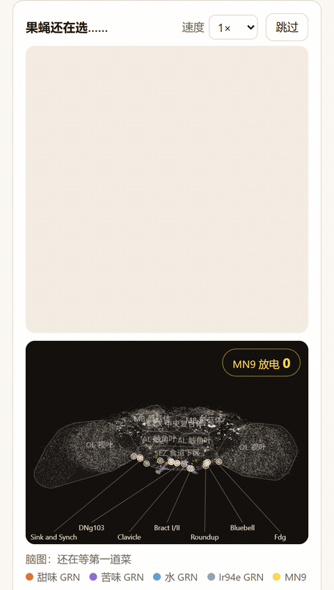

# 问问果蝇（Ask the Fly）

不知道吃什么时，就丢几道菜进来，让一个果蝇脑模型替你选一道。

English: [README.md](README.md)

在线试用：https://askthefly.app/

**最近更新**（完整列表见 [CHANGELOG.md](CHANGELOG.md)）

- v2.1.0（草稿，尚未发布）：新增 105 个条目，整理为 14 个分类，并为非食物条目加上标记和说明。味觉等级由编码器估算；现有菜品的分数和选择不变。

- v2.0.1（2026-09-19）：修订雄蝇脑图说明的中文措辞；其他不变。
- v2.0.0（2026-09-19）：加入第二只独立计算的雄蝇，分别展示结果和回放；可以比较两只果蝇的选择，不合并结果。雌蝇结果保持不变。
- v1.2.1（2026-09-15）：更新果蝇全部 16 组中英文台词，改用像素表情、气泡和字体；分数、状态和分配规则不变，诚实声明表不变。
- v1.2.0（2026-09-15）：新增四种设计状态、MN11 读数与示意动作。MN9 分数和排序不变；诚实声明表区分状态规则、动画和实测行为。
- v1.1.3（2026-09-13）：窄屏下盘子下方的长菜名不再挤在一起，超长部分显示省略号，title 提示保留完整菜名；行高不变。没有任何菜的分数变化；诚实声明表未改动。



## 目录结构
- `scripts/` — 数据提取与分析脚本
- `sim/` — 仿真代码
- `data/` — 冻结的输入、协议与生成结果
- `docs/` — 项目文档
- `site/` — 静态前端（无构建步骤，不调用 LLM）；见 docs/site.md
- `vendor/` — 已 gitignore，只读的上游参考数据与代码

## 署名与数据来源
- [MaleCNS v1.0](https://male-cns.janelia.org/release/)，Janelia FlyEM 雄性中枢神经系统连接组（Berg 等 2026）：[CC BY 4.0](https://creativecommons.org/licenses/by/4.0/)。我们的派生数据只保留至少 5 个突触的连接、移除自突触、赋予模型符号与权重、模拟反应，并投影坐标用于展示；查找表和回放是仿真输出，不是原始测量。
- Tastekin 等（2026），*Cell*：雄蝇 GRN 分型来自 Table S1（完整引文见下）；雌蝇保留 Shiu 的冻结细胞集。
- [blendi-remade/fly-brain-minecraft](https://github.com/blendi-remade/fly-brain-minecraft/blob/main/docs/VALIDATION.md)：采用这个独立项目中 Shiu 突触权重的 0.65 倍标定，并在本项目复现（M1i）；不是与动物行为数据的校准。
- FlyWire v783 连接组数据：CC BY-NC 4.0。
- Shiu 等（2024），*Nature*，模型代码：MIT。
- Eon fly-brain 基准仓库：GPL-2.0；仅作只读参考/数据使用，未复制任何代码。
- 素材：166 张菜品像素图和果蝇精灵图（`site/assets/`）是为本项目生成的原创像素画，以 CC BY 4.0 发布；代码仍为 MIT。仓库只跟踪处理后的精灵图，`assets/raw/` 里的 1024 px 原图不入库。
- FlyWire 神经元注释表（Schlegel 等 2024；github.com/flyconnectome/flywire_annotations）：CC BY 4.0。
- 分享卡二维码：qrcode-generator 2.0.4（Kazuhiko Arase），MIT，原样放在 `site/vendor/qrcode-generator/`，附许可证。
- 展示字体（自托管 woff2，由 `scripts/prep_fonts.py` 子集化）：Pixelify Sans（Stefie Justprince 与 Pixelify Sans 项目作者），SIL Open Font License 1.1，`site/assets/fonts/LICENSE-PixelifySans.txt`；缝合怪像素字体 Fusion Pixel 12px 比例版（TakWolf；基于方舟像素、俐方体 11 号和 Galmuri），SIL Open Font License 1.1，`site/assets/fonts/LICENSE-FusionPixel.txt`。中文字体只包含站点会显示的字符（`site/assets/fonts/glyphs-zh.txt`），其余字符回退到系统中文无衬线字体。
- 脑图里的神经髓轮廓：JFRC2NP 神经髓表面（Ito 等 2014 命名法）经变换到 FlyWire 空间，取自 fafbseg-py 的数据目录（github.com/navis-org/fafbseg-py，GPL-3.0；仅作数据使用，未复制代码），由 `scripts/export_neuropils.py` 投影到二维。网格压缩包放在 `data/external/`，不入库。
- 已命名的 SEZ 神经元（`data/named_neurons.json`）：ID 来自 Shiu 等 2024 随论文图表代码发布的 SEZ 神经元字典（MIT），DNg103 来自 FlyWire 注释表；Quasimodo、Scapula、GNG016 和 GNG510 在两个来源里都没有 FlyWire v783 对应，文件里如实记录。用于脑图的胞体位置（`site/data/neurons.json`）；表格本身放在 `data/external/`，不入库。

## 引用
仿真基础（分数从哪里来）：
- Shiu, P.K., et al. (2024). A Drosophila computational brain model reveals sensorimotor processing. *Nature*. PMC11446845. 模型代码（MIT）：github.com/philshiu/Drosophila_brain_model。
- FlyWire v783 连接组（Dorkenwald et al. 2024；Schlegel et al. 2024），CC BY-NC 4.0。
- Schlegel, P., Yin, Y., Bates, A.S., et al. (2024). Whole-brain annotation and multi-connectome cell typing of Drosophila. *Nature* 634, 139–152. 注释表（细胞核位置、细胞类型）：CC BY 4.0。

第二套实验使用的雄蝇重建与 GRN 分型：
- Berg, S., Beckett, I.R., Costa, M., … Hess, H.F., Rubin, G.M., Jefferis, G.S.X.E. (2026). Sexual dimorphism in the complete Drosophila male central nervous system connectome. *Cell* 189(18), 5504–5526.e15. https://doi.org/10.1016/j.cell.2026.08.015（MaleCNS；雄性脑 + 腹神经索）。
- Tastekin, I., de Haan Vicente, I., Beresford, R.J., Morris, B.J., Beckett, I., Schlegel, P., Gkantia, M., Marin, E.C., Costa, M., Jefferis, G.S.X.E., Ribeiro, C. (2026). The complete gustatory connectome of adult Drosophila reveals how taste guides feeding, foraging, and social behavior. *Cell* 189(18), 5527–5551.e5. https://doi.org/10.1016/j.cell.2026.08.016。

产品页的来源说明："雌蝇分数保留已发表的 LIF 模型在 FlyWire v783 上的结果（Shiu 2024）。第二只果蝇使用 MaleCNS v1.0 和 Tastekin 的 GRN 分型，另行规定刺激协议和权重标定。这是两套独立实验。"

## 屏幕上看到的是什么

- **一段真实仿真结果的回放。** 深色脑图会按照 FlyWire 的胞体坐标画出 29,326 个神经元，然后播放当前味觉条件下预先记录好的一秒放电。画面里的每一次闪烁，都对应 Brian2 模型实际记录到的 spike；这里展示的是回放，并不是在浏览器里现场跑仿真。
- **果蝇动画由模型结果来驱动。** 它会挨个去尝每个盘子，最后落在 MN9 平均反应最强的那一道上；两种模式里果蝇都是这么做的。“问问果蝇想吃啥”把果蝇选的那道给你；“让果蝇先吃”把剩下的给你：两道菜时是另一道，更多时是余下的全部，结果页和分享卡都会这么写。结果完全相同的菜会并列。
- **LLM 负责把菜转成味觉输入，连接组模型负责算出脑反应。** 编码器会先估算每道菜的甜、苦、水和 Ir94e（氨基酸厌恶）四个维度的等级（`data/dishes.json`），然后用这四个味觉输入去查预先算好的 400 格结果表。菜品到输入的映射是我们设计的；MN9 反应来自连接组模型。
- **这些结果都可以复现。** 每个回放文件里都会保存对应的条件、刺激等级、随机种子、commit 和协议哈希，并由 `scripts/run_replay.py` 统一生成。

## 这个模型能说明什么，又不能说明什么

下表原有的雌蝇声明仍只针对雌蝇；明确写出雄蝇或两只果蝇的行，说明第二套实验及两者的比较。

| 说法 | 状态 | 依据 |
|---|---|---|
| 非食物条目也由同一个编码器估算糖、苦、水和 Ir94e 等级。模型不表示可食用性；果蝇只对这四个估算等级作出反应。 | **模型** —— 对四个等级的反应；**我们的设计** —— 条目名称、非食物分类和编码器估算。这不是可食用性判断。 | [编码器](docs/encoder.md)、[分类](data/dish_sections.json) |
| 分数来自已发表的雌性果蝇脑 LIF 模型，运行在 FlyWire v783 上 | 是 | Shiu et al. 2024；docs/phase0_report.md |
| 糖驱动、苦抑制、以 MN9 作为伸喙读数 | 已复现（方向） | docs/phase0_report.md，门槛 A–D |
| 模型有自发活动 | **否** —— 基线按构造为 0 Hz | Shiu 2024 Methods；我们的条件 D |
| 表达了去抑制（富集的 LB3 → Quasimodo → MN 回路） | **否** —— 基础放电为零，没有可释放的持续性抑制；v1 只包含前馈的 Clavicle 通路 | Tastekin et al. 2026，图 6I/6J、图 S17；docs/open_questions.md OQ-3 |
| 覆盖完整的进食序列 | **否** —— 真实进食是一串检查点：足部刚毛 → 唇瓣刚毛 → 味觉钉 → 咽。本仿真只覆盖唇瓣刚毛这一站。 | Tastekin et al. 2026，讨论部分 "Sequential checkpoints and action control" |
| 水在模型里是独立的味觉品质 | **否** —— 在这个模型里水是第二种食欲驱动，主要帮弱糖加分（糖 40 Hz + 水 40 Hz 得到 24 Hz MN9，单独糖只有 4 Hz；糖 200 Hz 时只多 7%）。所以湿的咸菜会赢过干的。这是连接组模型的性质，不是我们写的规则。 | docs/phase1_characterization.md，糖 × 水 |
| Ir94e 是氨基酸厌恶通道（Tastekin et al. 2026，LB1e）。每道菜对应哪个 Ir94e 等级是我们定的（编码器 v2.3）。它对 MN9 的作用是模型的：在糖低 / 水低时，MN9 沿 无 / 低 / 中 / 高 从 61.8 → 9.3 → 1.6 → 0.5 Hz。在这个模型里，果蝇把清淡的主食排在所有肉类或酱油调味的菜之上。这种抑制的强度没有和行为数据校准过（docs/open_questions.md OQ-6）。 | 方向已复现，映射是设计的 | docs/phase1_characterization.md，糖 × ir94e；docs/encoder_stability_v2_3_batch2.md |
| 使用了 2026 年 9 月的完整味觉接线（MaleCNS） | **是** —— 产品中加入了第二只独立计算的雄蝇，使用 MaleCNS v1.0 和 Tastekin 的 GRN 分型；雄蝇的连接图只保留至少 5 个突触的连接，所以“完整”要打个折扣。冻结的雌蝇实验保持不变。两只果蝇各用各的查找表，不合并分数或选择。 | [雄蝇项目记录](docs/male_fly_v2.md) |
| 雄蝇脑使用 MaleCNS v1.0，只保留至少 5 个突触的连接，突触权重为 Shiu 的 0.65 倍（0.17875 mV）；这套标定取自独立项目 blendi-remade/fly-brain-minecraft，并由我们复现。雌蝇使用 FlyWire v783、全部连接和 Shiu 的 0.275 mV。 | **模型** —— 速率来自连接组 LIF 模型；连接截断门槛和采用的权重标定是设计选择，并非与动物行为数据的校准。 | [雄蝇项目记录](docs/male_fly_v2.md)；[M1i 复现](docs/malecns_phase0.md) |
| 雄蝇接受双侧刺激，使用 Tastekin 分型的 GRN 细胞集；雌蝇接受单侧刺激，使用 Shiu 的细胞集。两只果蝇并不共用一套刺激协议。 | **模型** —— 反应分别在各自协议下计算；细胞集、刺激侧和驱动强度由我们选择。共用的菜品等级是编码器估算，不是实测味觉输入。 | [雄蝇协议与细胞集](docs/male_fly_v2.md) |
| 雄蝇脑未通过我们四项行为门槛中的一项：单独以 25 Hz 刺激苦味时，MN9 为 1.07 Hz，超过我们设定的 1.0 Hz 上限（docs/malecns_phase0.md，M1j）；它低于产品的 5 Hz 活动阈值，在显示中看不出来，但仍如实记录。 | **否** —— 雄蝇没有通过全部四项门槛。MN9 速率是模型输出；1.0 Hz 门槛上限和 5 Hz 显示阈值是我们定的。 | [M1j 记录](docs/malecns_phase0.md)；[承诺](docs/male_fly_v2.md) |
| 两只果蝇意见不同时，原因可能是性别、重建、细胞分型、兴奋或抑制符号的赋值、权重或刺激协议；这套流程无法区分这些因素。只要选择不同，这句话就会出现在结果页上，而不只放在 README 里。 | **否** —— 选择不同不能单独归因于性别。不同选择来自模型结果；固定展示这段解释是我们的产品规则。 | [雄蝇项目记录](docs/male_fly_v2.md) |
| 两只果蝇在 71% 的菜品配对上意见一致；带苦味的菜没有一道能让雄蝇达到“吃”，MN11 很少激活 | **模型** —— 本设计下的测量：15,051 对中有 10,723 对一致（71.2%，包括平局）。174 道菜的雄蝇状态为 12 / 0 / 90 / 72（吃 / 嘴动了 / 只伸了喙 / 无明显反应）；72 道的主 MN9 低于我们设定的 5 Hz 阈值。这里的“拒绝”仅指带苦味的菜都未达到设计的“吃”状态：66 道中有 56 道 MN9 低于 5 Hz，另 10 道为“只伸了喙”。“很少激活 MN11”指 MN11D 三细胞均值仅在 12 道菜中达到我们设定的 5 Hz 状态阈值，不代表没有 MN11 放电，也不是实测的拒食行为。 | [Phase 2 比较](docs/malecns_phase2.md) |
| 雄蝇分数和四种状态标签是测得的进食行为 | **否** —— 模型速率按我们的规则分类：只用主 MN9 L10331 给菜排序；状态使用它的 30 次试验均值，以及每次试验中三个 MN11D 细胞平均速率的 30 次均值，以我们设定的 >=5 Hz 为活跃阈值。次 MN9 R16949 和 MN11V 不参与判定。标签、动作和台词是设计，未声称经过行为校准。 按我们的示意状态，这只脑面对这些菜时通常只伸喙、嘴却没跟上（三细胞 MN11D 均值仅在 400 格中的 9 格达到设计的 5 Hz 阈值），所以“只伸了喙”是它在这份菜单上的常态，不是偶发现象。 | [雄蝇读数与状态规则](docs/male_fly_v2.md) |
| 雄蝇脑图展示实时活动，且每个神经元都在真实解剖位置上 | **否** —— 活动来自网格试验 0，是该格分数所依据的 30 次试验之一，不是实时仿真，也不是均值。前视图使用 MaleCNS v1.0 胞体或入脑点坐标。228 个回放索引内的神经元缺少这两种坐标，另有一个追加的读出细胞；我们将它们放在突触后位点坐标的中位数位置，没有突触后位点时使用全部突触位点的中位数。这些是突触位置估计，不是测得的胞体位置。轮廓是 MaleCNS v1.0 脑区 ROI 网格（fullbrain-roi-v4，Janelia FlyEM，CC BY 4.0）在同一前视坐标框架中的二维凸包。腹神经索胞体放在底部条带。补位规则、投影、分组和布局由我们设计；坐标及 ROI 网格来自解剖数据。 | [Phase 2 回放规则](docs/malecns_phase2.md)；`site/data/neurons_male.json`；`site/data/neuropils_male.json` |
| 持续性抑制 / 去抑制（Tastekin 2026，图 S17） | 不在产品内；是一个设计出来的实验条件（docs/tonic_inhibition.md）。以 100 Hz 驱动 CB0806 或 CB0862 能在糖刺激下压住 MN9；三个"刹车"神经元没有一个被糖压制，所以在这个设计下没有观察到去抑制。糖确实会激活 CB0465，这是一个前馈刹车，已经包含在产品的每个分数里。刹车的选择和驱动强度都是我们定的，未经校准。 | docs/tonic_inhibition.md；OQ-3 |
| 脑图是实时仿真 | **否** —— 它回放每个格子一次记录好的 1 秒试验（固定种子），来自同一个模型；位置是 FlyWire 胞体坐标，活动是记录到的放电时刻 | docs/site.md，`site/data/replay/` 文件头 |
| 果蝇动画是测得的行为 | **否** —— 动作、口器特写、情绪和台词是我们根据查找表状态设计的示意，不是模型测得的动作或感受 | docs/site.md |
| 四种状态能确定果蝇是否进食 | **否** —— MN9、MN11 的速率来自模型；我们用左 MN9 和 MN11D 双细胞平均速率各自的 30 次试验均值，按设计的 5 Hz 阈值分类。右 MN9 和 MN11V 不决定状态。标签未经行为校准；排序仍用未改变的左 MN9 分数 | docs/grid_provenance.md, docs/feeding_mn_readouts.md |
| 果蝇的排名是实时计算 | **否** —— 一张预先算好的 400 格查找表（每格 30 次试验，`data/lookup_table.json`）；页面只是读取它 | docs/grid_provenance.md |

在这个模型里，微量的水只在帮糖时才被看见；只有食物基本是水时，果蝇才注意到水。因此查找网格把水的"低"和"中"放进同一个格子（60 Hz）：固定路径复核（docs/fixed_path_recheck.md）在任何一条曲线上都分不开它们。

当果蝇自己选的那道菜 MN9 低于 5 Hz 时，结果会多一句"这个只是最不无聊的一个"；这个 5 Hz 阈值是我们定的，只改措辞，不改选择也不改平局。

产品口号："它只管第一口。"

## 运行、测试、重算

运行已构建的网站、跑快速测试、获取仿真输入、重算仿真，是四件不同的事。前两件不需要仓库之外的任何东西。

**运行网站。** `python -m http.server 8765 --directory site`，然后打开 http://127.0.0.1:8765/。网站是静态的：它读取的所有文件都在 `site/data/` 和 `site/assets/` 里；不需要 API key，不需要 vendor 数据，也没有构建步骤。

**跑快速测试。** Node 22：`node --test site/test/app.test.mjs site/test/regress.test.mjs`（纯函数、随站数据、审计回归）。Python 3.11+，只用标准库：`python -m unittest discover -s tests`（编码器合并门禁、仿真账本与种子、发布校验器）。`python scripts/validate_release.py` 检查生产数据包（无 stub、无未审核条目、源数据与站点副本一致、回放 variant 齐全、MN9 数值有限）。浏览器检查需要 Playwright：对本地服务器运行 `python scripts/browser_checks.py`。

**获取并验证输入。** `vendor/fly-brain/` 不在仓库里跟踪；它是 Eon fly-brain 仓库在某一个 commit 上的副本：

```
git clone https://github.com/eonsystemspbc/fly-brain vendor/fly-brain
git -C vendor/fly-brain checkout a3db62f9436074e485c0278290c2164ed6150808
sha256sum vendor/fly-brain/data/2025_Connectivity_783.parquet vendor/fly-brain/data/2025_Completeness_783.csv data/cells.json data/stim_protocol.json data/grid_levels.json
```

预期 SHA-256：

| 文件 | sha256 |
|---|---|
| vendor/fly-brain/data/2025_Connectivity_783.parquet（100.8 MB，v783 连接矩阵） | `efeb23fb99098e9c390f6869969b2a121a2ee92c833cfc45ecb2c1d8e1af0347` |
| vendor/fly-brain/data/2025_Completeness_783.csv（3.5 MB） | `52b0ac6094cd32c546f8d4c341e094376f48f4e791f8db9b166de5dff8199ea4` |
| data/cells.json（已跟踪；GRN 与 MN9 的 root ID） | `f78f5071af3bf0984e2e71326f715777c567794e03c0e6369846a147015b395a` |
| data/stim_protocol.json（已跟踪；频率、试验次数、读数 = 左侧 MN9，指向 vendor 文件） | `9f9495033281bfcd6f3b373551817987deb2cc083ae94ab61fece9065102d82a` |
| data/grid_levels.json（已跟踪；400 格网格） | `33a1dab4a03a440298d12c7ba2365e88457268b4ee3a220f15981b2702350780` |

每次运行都会把这些哈希写进自己的 `run_meta.json`；`docs/grid_provenance.md` 记录了已发布的表对应的 commit。缺少 vendor 文件时，脚本会给出明确提示后停止。

**重算仿真。** 正式运行使用 Brian2 2.9.0 的 Cython 目标，需要 C++ 编译器；我们在 WSL2 Ubuntu 里的 conda 环境 `flybrain` 中运行（`env/flybrain.yml`，精确导出 `env/flybrain-lock.yml`；踩坑记录见 `docs/environment.md`）。没有 `cl.exe` 的原生 Windows 会在代码生成阶段失败。

```
# 在 Linux / WSL2 的仓库目录下，上面的输入就位之后
conda env create -f env/flybrain.yml
conda run -n flybrain --no-capture-output python scripts/run_phase0.py --stage smoke --target numpy   # 流程检查，不需要编译器
conda run -n flybrain --no-capture-output python scripts/run_phase0.py --stage full --n-proc 14       # 540 次试验，14 个进程约 4 分钟（每个约 3 GB 内存）
conda run -n flybrain --no-capture-output python scripts/phase0_report.py                              # 重新生成 docs/phase0_report.md
```

在 Windows 命令行里，同样的命令写成 `wsl -e bash -lc 'cd /mnt/d/<repo> && ~/miniforge3/bin/conda run -n flybrain --no-capture-output python scripts/run_phase0.py --stage full'`。

**应该看到的结果**（左侧 MN9，30 次 1 秒试验的均值；不同随机流之间有几 Hz 的波动）：

| 门槛 | 条件 | 预期（Hz） |
|---|---|---:|
| A | 糖 25 / 50 / 100 / 200 Hz | ≈ 0 / 17 / 67 / 92 |
| B | 糖 200 Hz + 苦 0 / 25 / 50 / 100 / 200 Hz | ≈ 93 / 79 / 70 / 28 / 1 |
| C | 只有苦，任何频率 | 0 |
| D | 无刺激 | 0 |

这些门槛主要看的是变化方向（A 上升、B 下降，C 和 D 保持为零），而不是要求绝对数值和论文完全一致。之所以会有数值差异，是因为论文是在 v630 上标定 `w_syn` 的，而这里直接沿用了同一参数去运行 v783。两次使用不同随机流的完整运行，在糖 100 Hz 这一点分别得到 67.2 和 67.3 Hz（`docs/phase0_report.md`、`docs/fixed_path_recheck.md`）。

**Phase 0 之后。** `scripts/run_phase1.py` 会生成 `docs/phase1_characterization.md` 里的单通道和成对曲线；`scripts/run_grid.py --stage full` 会跑完整的 400 格查找网格（14 个进程大约需要 80 分钟），然后由 `scripts/build_lookup.py` 把结果整理成 `data/lookup_table.json`，这是网站读取的唯一一份分数文件；`scripts/run_replay.py run` 与 `pack` 记录并打包 `site/data/replay/` 里的脑回放。试验种子遵循 `docs/grid_provenance.md` 里的版本化方案（已发布的表是在 v1 方案下生成的；用 v2 重算会得到不同但等价的随机流）。

## 如何申请加一道菜

网站目前只认识 `data/dishes.json` 里已经收录的菜。如果页面提示“果蝇还没吃过这道菜”：

1. 点那一行的 **提交这道菜**。页面会打开一个已经预填了你所输入名称的 GitHub issue。再补上中文名、英文名，以及一句话说明这是什么菜就可以了。（你也可以手动新建 issue，填写同样的四项内容。）
2. 对于新菜，我们先用 `encode_v2.2` 估算甜、苦、水，再用 `--only-dimension ir94e` 仅加入 `encode_v2.3` 生成的 Ir94e 等级。每个提示词都在两种语言下各编码六次，并按 `docs/encoder.md` 的跨语言仲裁规则合并。`encoder_version_by_dimension` 记录 Ir94e 的版本；已冻结的甜、苦、水数值保持不变。如果两边的判断相差两级以上，就会标记为 `needs_review`，再由人工裁定。
3. 不需要重新跑仿真。甜、苦、水和 Ir94e 这四个味觉输入会直接映射到预先算好的 400 格网格里。审核并发布后，这道菜就会出现在词典和网站上。

如果一个名字可能对应不止一道菜（比如 “biscuit”），就会按照 `data/ambiguous_names.json` 拆成多个条目。如果你提交的菜属于这种情况，请在 issue 里顺便说明。
